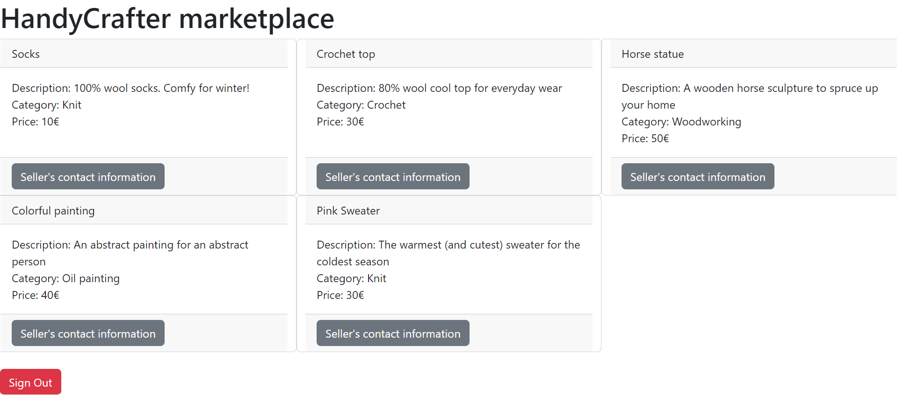
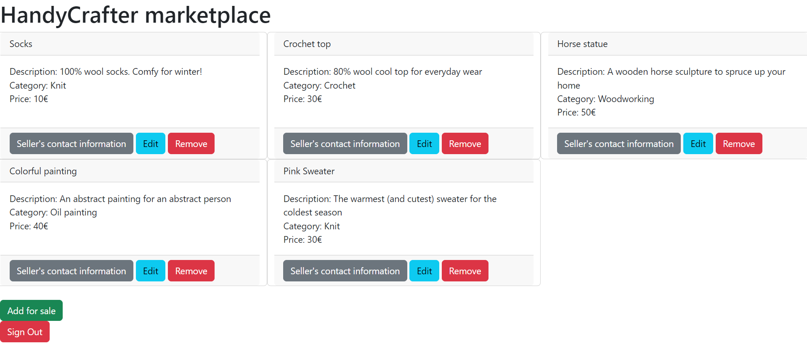
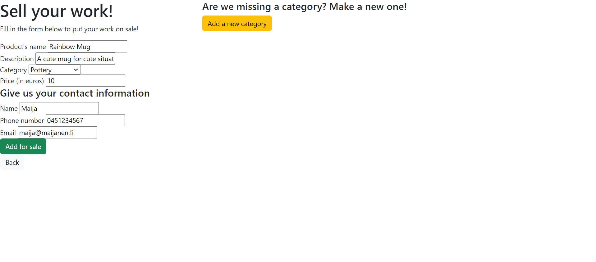
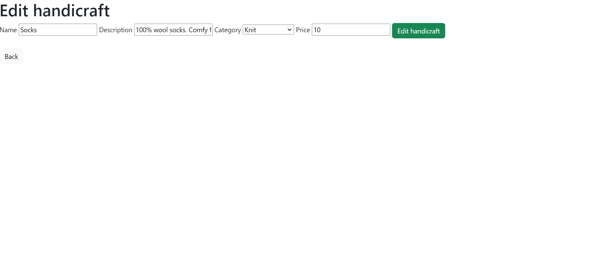

## HandyCrafter marketplace
HandyCrafter is a marketplace for handy people to sell their beautiful work. Sellers can list theier products and users can contact the sellers via email, text message or a call. Users logged in as "user" can view products and seller information. Users loggen in as a "seller" can do the same things as "user" and also add new handicrafts, edit them, remove them and add new categories for handicrafts.

# Technologies used
- Java Spring Boot
- Thymeleaf
- JUnit tests

# Screenshots
User's view of products

Seller's infromation

Seller's view of products

Adding a new handicraft

Adding a new category for new handicrafts

Editing the information of an existing handicraft
